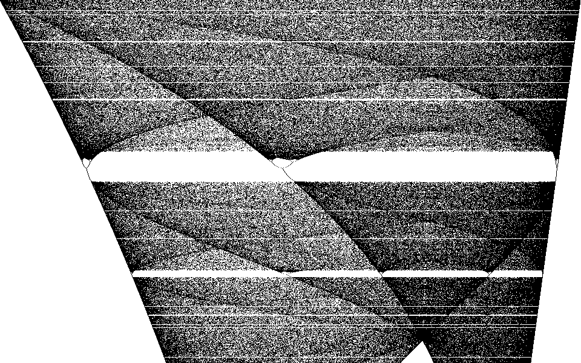
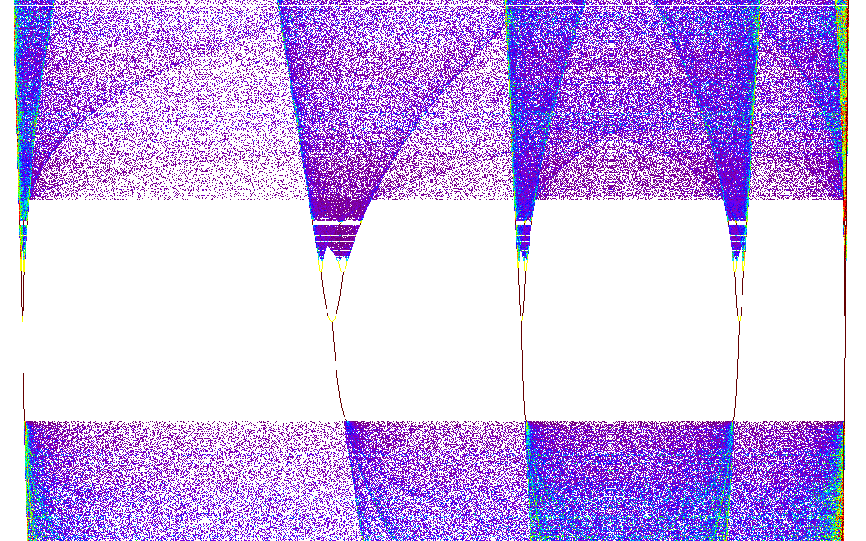
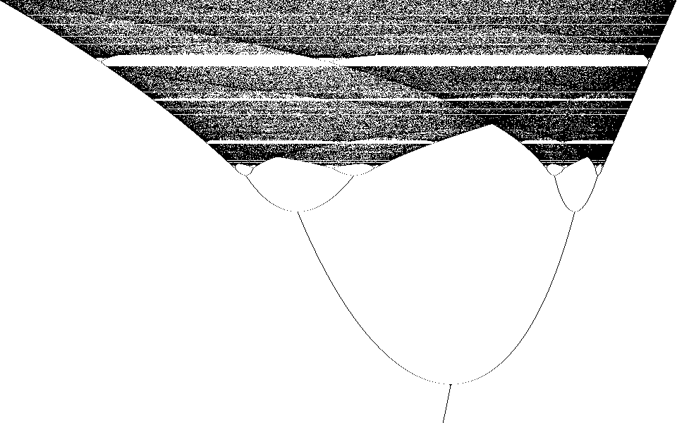

# Logistic-Map
Chaotic Logistic Map [LM]: Investigation of the [1] spacing; and [2] vertical width of the infinity of horizontal 'voids,' or bands, that occur in the LM.
# Chaotic Logistic Map

 PURPOSE: Investigation of the 

    [1] spacing; and 
    [2] vertical width 
    
of the infinity of horizontal 'voids,' or bands [e.g., re figures below] that occur in certain regions of the Logistic Map (LM);
In this note the points of the LM are labeled with coordinates ( x, R ).
The ‘normalized population’ x, 0 &lt;= x &lt;= 1, is the
horizontal coordinate (abscissa). The ‘effective birth rate’ R,
2.9 &lt;= R &lt;= 4, is the vertical coordinate (ordinate). 

    [3] For each R, assign musical notes to the { x }; play the resulting 'music.'

For fixed R, the points of the LM  ( x0, R ),  ( x1, R ),  ( x2, R ), ... ,  that lie in a single row may be computed iteratively using the rule

xn+1 = R * xn * (1 - xn) = fR( xn )

Representative points for the LM are then calculated by picking values for R  that lie in the range 2.9 &lt;= R &lt;= 4 and computing iteratively using this rule, row after row.

For our purposes a "band” is simply a region that is traversed
from below [i.e., from smaller to larger values of R] by a finite
number of curves, x = x(R), that express the periodicity [as opposed
to the chaos] at the lower boundary of the region. 

	

abscissa: 'normalized population x:' 0 &lt;= x &lt;= 1 )  
ordinate: ‘effective birth rate R:' 3.63 &lt; R &lt;= 4

	

abscissa: 'normalized population x:' 0.2 &lt; x &lt; 0.9 )  
ordinate: ‘effective birth rate R:' 3.71 &lt; R &lt; 3.77

<b>Usage: (after downloading and building [e.g., use qt creator]) </b>

<ol>
	<li>To
	execute, click on<b> Logistic_Map,
	</b>or type
	and enter<b> Logistic_Map
	previous_session.json </b>from
	a terminal window;<b>  </b>here<b>
	</b>&quot;previous_session.json&quot;
	represents any file that you created earlier.
	<li><b>zoom
	in: </b>right-click and
	hold button down, 'drag' a rectangular boundary, then release the
	right-click; i.e., right-drag a ‘selection rectangle’ within the
	figure to zoom into the rectangle, or, if the SHIFT key is pressed when releasing the mouse button, 
	play 'musically' the selected rectangle.
	<li><b>translate
	origin to a point: </b>left-click
	on the point for the new origin.
	<li><b>record
	the (x, y) == (x, R) coordinates of a particular
	point-of-interest
	[P.O.I]:</b>
</ol>
<ol type="a">
	<li>
 control-left-click
	on the point; you may enter a label for this point
	<li>
control-shift-left-click;
	            no user-defined label for this P.O.I
</ol>

<ul>
	<li>A history
	of is created for each session. This history includes: left, right,
	bottom and top coordinate boundaries for each rectangle, and any
	P.O.I. that you recorded. 
	<li>A visual summary of this history
	appears as a &quot;dialog window&quot; [DW] adjacent to the main
	window.
	<li>Click on the left-border item numbers
	of the DW to inspect the boundary coordinates.
	<li>Click on the interior of this window
	of the DW to go back to a previous region.
	<li>A png image of any particular image may
	be saved by using the menu-File-&gt;Save option;
	<li>Alternately, if the Auto-Save checkbox
	is selected, a png file is created for each figure.
	<li>The number
	of points calculated per pixel row may be increased or
	decreased, in a hopefully obvious mannner.
	<li>You may also choose the number
	of threads to commit to a computation.
	<li>You may <b>create
	&quot;music</b>al tones&quot; as the LM points are
	computed, also in a hopefully obvious manner.
</ul>

<b>Appendix: </b>To generate figure 1: 

	

Values of R are selected uniformly from the range 2.9 to 4 at
evenly spaced ordinare values. For each of these R values a pseudo-random
initial value x0,  0 &lt; x0 &lt; 1 is chosen for x. Then a sequence of
abscissa x1 = fR(x0), x2 = fR(x1), x3 = fR(x2), … is calculated. This
sequence is called an orbit. Then some of the points, say, the first
one or two thousand, are discarded, with the hope that the remaining
(x, R) are near convergence to their respective attractor [if any];
the remaining ( x2000, R ), ( x2001, R ), …, ( xlast, R ), …
are plotted. 

<b>Ranges: for each rectangle, with (x, R) = (x_t, y_t): 
</b>

0 &lt;=  col_x &lt;= (screenWidth   - 1) ) ;  x_min_t &lt;= x_t &lt;= x_max_t
0 &lt;=  row_y &lt;= (screenHeight  - 1) ) ;  y_min_t &lt;= y_t &lt;= y_max_t

	x_t = x_min_t + ( ( x_max_t - x_min_t )  / (screenWidth   - 1) ) * col_x ;
	y_t = y_min_t + ( ( y_max_t - y_min_t )  / (screenHeight  - 1) ) * row_y ;

	width_t  = x_max_t - x_min_t;
	height_t = y_max_t - y_min_t;

	x_t = x_min_t + ( width_t   / (screenWidth   - 1) ) * col_x ;
	y_t = y_min_t + ( height_t  / (screenHeight  - 1) ) * row_y ;

	normalized_width_t  = width_t  / (screenWidth  - 1);
	normalized_height_t = height_t / (screenHeight - 1);

	x_t = x_min_t + normalized_width_t  * col_x ; col_t = (x_t - x_min_t)/normalized_width_t;
	y_t = y_min_t + normalized_height_t * row_y ; row_t = (y_t - y_min_t)/normalized_height_t;

	rate_t = y_min_t + normalized_height_t * row_y
 ==  y_min_t + (y_max_t - y_min_t) * ( row_y / (screenHeight-1) )

<b>Computation:
</b>

The GNU Multiple Precision Arithmetic Library, with a precision of
400 decimal points, is used to computationally generate the sequence
{( x0, R ), ( x1, R ), …, ( x1000, R ), ( x1001, R ), …, (
xlast, R )}. WARNING: xlast may be such that &quot;last&quot; is on
the order of a million [or more, depending on how you have things set
up]. For example, if you have zoomed in by a factor of one million
then MOST of the computed points (x, R) will NOT satisfy x_min_t &lt;=
x &lt;= x_max_t, and WILL NOT SHOW UP ON YOUR PLOT. You may need a
large sample size to get a satisfactory number of points to fall
inside your zoomed-in region. Although this calculation is
multi-threaded, it may still take some time to complete a figure.  These
 calculations were performed using 27 threads on a ‘16 core’ 2950X.

This project is a "work in progress," and requires sufficient patience and prior knowledge to build. This [fedora or ubuntu] linux program uses libraries from Qt, png, gmp, mpfr, range-v3, nlohmann/json, QJsonModel, RxCpp and 'toot', among others; source code is included for the latter three [the latter five may be found on github]. 

For example, on Ubuntu try

apt install libpng-dev libpng16-16

apt install librange-v3-dev

apt install libgmp-dev libmpfr-dev libmpfrc++-dev

//JSON for Modern C++ https://nlohmann.github.io/json/

git clone https://github.com/nlohmann/json.git

    cd json; mkdir build; cd build; cmake ..; cmake --build . ; sudo make install
  

<h1>License </h1>
<b>Logistic_Map</b> is copyright © 2019+ Patrick L. Nash and released under the MIT license
